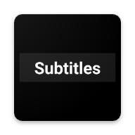
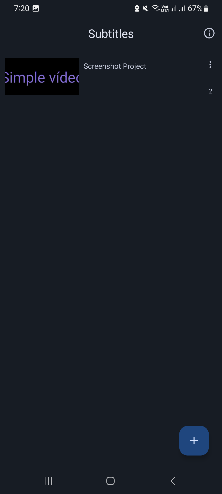
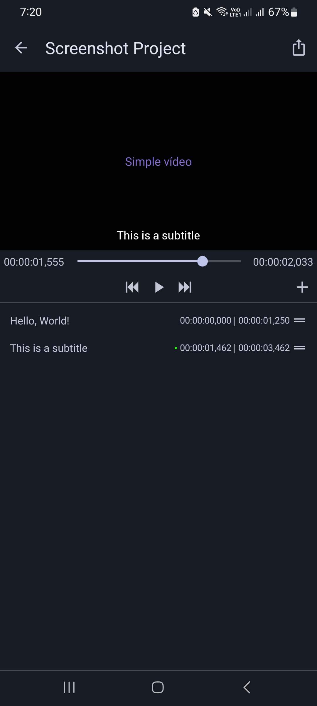

  

<h2 align="center"><b>SubTypo(graphy)</b></h2>

A video subtitle editor/maker for Android

## Screenshots

<b>Advantages of using SubTypo 📽</b>

* Does not collect any of your data
* Completely free
* Beautiful and easy to understand interface
* No ads

## Contributors 🌐

Commits should always be made to the `dev` branch, the `main` branch is protected and will only contain release commits. 

## Thanks to
- [Akash Yadav](https://github.com/itsaky) for the awesome [AndroidIDE](https://github.com/AndroidIDEOfficial/AndroidIDE)

